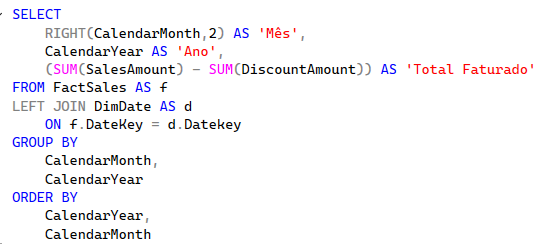
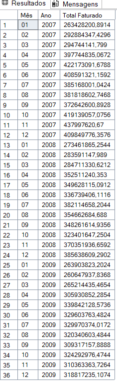
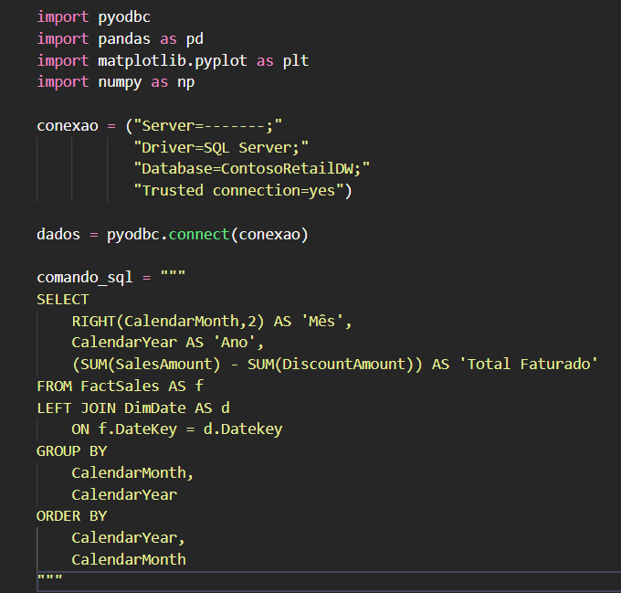
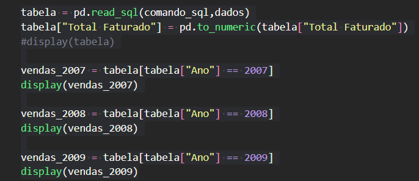
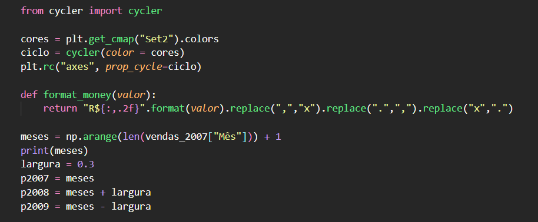
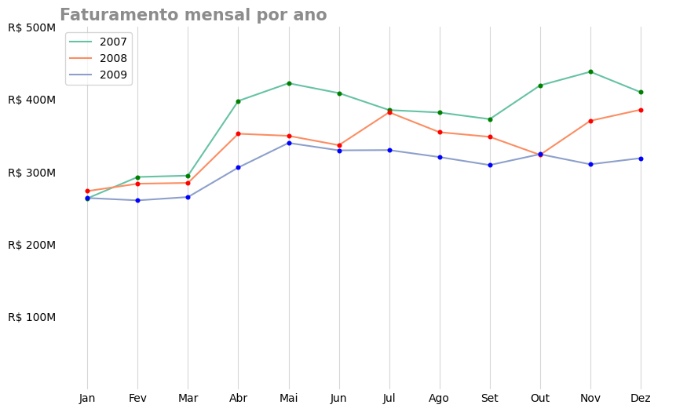
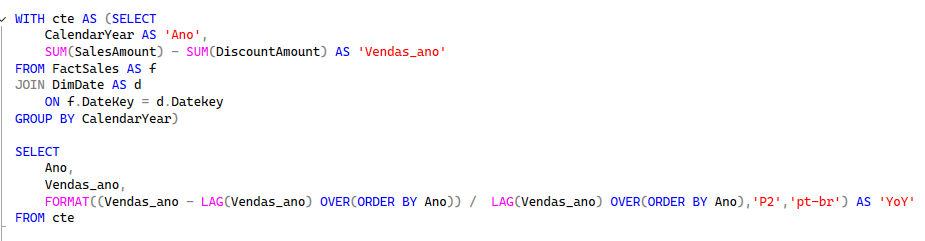
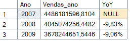
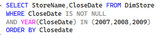
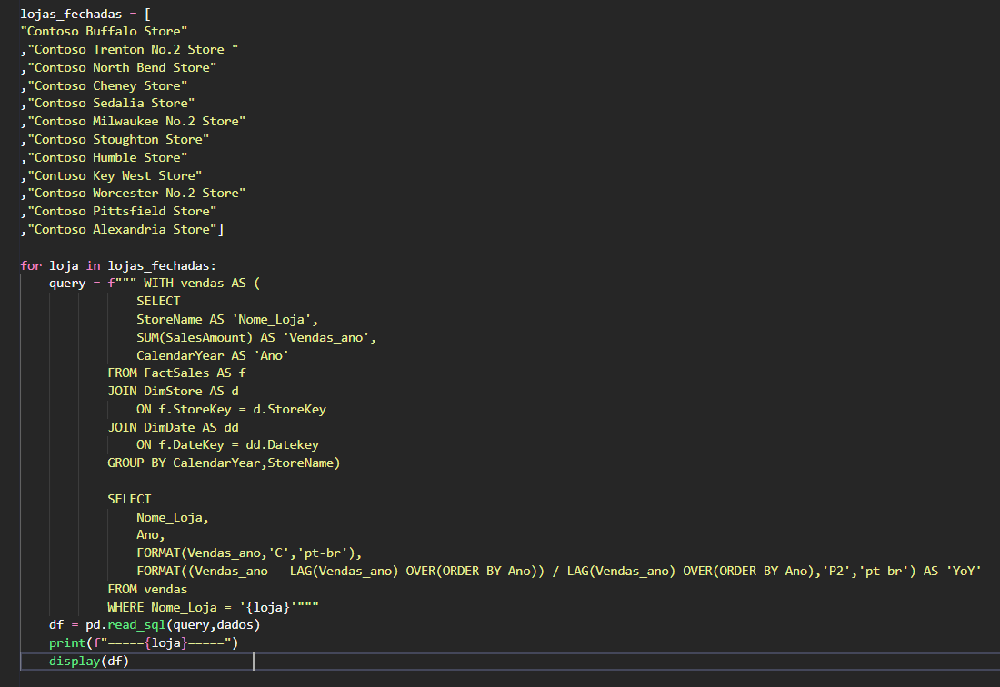

# Análise Comparativa de Vendas Mensais (Ano a Ano)

## Introdução

Este projeto tem como objetivo analisar o desempenho anual de vendas da empresa **Contoso**, utilizando dados do banco de dados Contoso fornecido pela Microsoft. A análise envolve extração de dados via SQL, tratamento e visualização em Python, e interpretação dos resultados para buscar possíveis causas de variações no faturamento.

Nos próximos tópicos, detalho as consultas SQL, resultados obtidos, processamento em Python e conclusões.

## 📚 Sumário

* [Introdução](#introducao)
* [Consulta do faturamento](#-consulta-sql-utilizada)
* [Resultado da Consulta](#-resultado-da-consulta)
* [Análise em Python](#-análise-em-python)
* [Separação dos Dados](#separacao-dos-dados-por-ano)
* [Configurações da Visualização](#configuracoes-da-visualizacao)
* [Código do Gráfico](#codigo-para-geracao-do-grafico)
* [Gráfico Final](#-grafico-gerado)
* [Consulta de Variação Year over Year](#-variação-percentual-no-faturamento)
* [Variação YoY](#variação-percentual-no-faturamento)
* [Query Lojas Fechadas](#-descobrindo-possíveis-motivos-da-alteração-no-faturamento)
* [Lojas Fechadas](#descobrindo-possíveis-motivos-da-alteração-no-faturamento)
* [Faturamento das Lojas Fechadas](#observando-faturamento-individual-das-lojas)
* [Conclusão](#-conclusao)

# Análise Comparativa de Vendas Mensais (Ano a Ano)

Este repositório apresenta uma análise de vendas mensais da empresa **Contoso**, comparando o faturamento ao longo dos anos com base em dados extraídos via SQL e posteriormente analisados em Python.

## 📊 Consulta SQL Utilizada

A consulta SQL abaixo foi utilizada para obter os dados iniciais:

## 📈 Resultado da Consulta

O resultado obtido da consulta foi o seguinte:

## 🐍 Análise em Python

Com os dados em mãos, foi realizada uma análise utilizando Python:

### Separação dos Dados por Ano

Para facilitar a visualização, os dados foram separados por ano:

### Configurações da Visualização

Antes da criação do gráfico, algumas configurações importantes foram definidas:

### Código para Geração do Gráfico

O gráfico final foi gerado com o seguinte código:

## 📉 Gráfico Gerado

Aqui está o gráfico resultante da análise:

## 💹Variação percentual no faturamento

Usei a seguinte query para descobrir a variação percentual ano a ano:

E com isso obtivo o seguinte resultado:
Diminuição de -9,83% em 2008(em relação a 2007) e de -9,06% em 2009(em relação a 2009)

## 💸Descobrindo possíveis motivos da alteração no faturamento

Para descobrir um possível motivo da alteração no faturamento da companhia, busquei primeiramente por possíveis lojas que não estavam mais na ativa nos anos em questão. Para isso, usei a query:

E o resultado foi esse:
2 Lojas fechadas em 2008, e 10 Lojas fechadas em 2009

## Observando faturamento individual das lojas

Para analisar o faturamento individual de cada loja e ver as variações no seu faturamento, foi utilizado o seguinte código:

## ✔️Conclusão

A companhia CONTOSO teve seu faturamento reduzido em mais de 18% de 2007 para 2009 devido ao fechamento de 12 lojas ao decorrer de 2008 e 2009.
O fechamento dessas lojas ocorreu devido a queda em seu faturamento, algumas delas sofrendo com queda de mais de 50% de seu faturamento.

## 🛠️ Tecnologias e Bibliotecas Utilizadas

### **SQL**

* Microsoft SQL Server
* Banco de dados Contoso
* Consultas para extração e agregação de dados

### **Python**

* **Pandas** — manipulação e organização dos dados
* **Matplotlib** — criação do gráfico final
* **Numpy** - separação dos meses
* **Jupyter / Ambiente de análise** — execução do código e visualização

