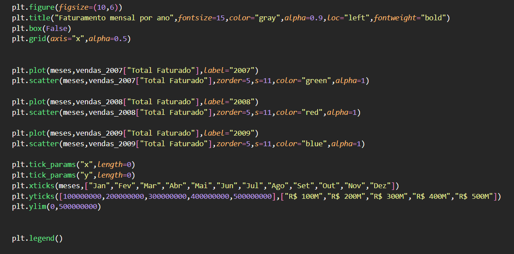

# Análise Comparativa de Vendas Mensais (Ano a Ano)

## 📚 Sumário

* [Introdução](#análise-comparativa-de-vendas-mensais-ano-a-ano)
* [Consulta SQL](#-consulta-sql-utilizada)
* [Resultado da Consulta](#-resultado-da-consulta)
* [Análise em Python](#-análise-em-python)
* [Separação dos Dados](#separação-dos-dados-por-ano)
* [Configurações da Visualização](#configurações-da-visualização)
* [Código do Gráfico](#código-para-geraçao-do-gráfico)
* [Gráfico Final](#-gráfico-gerado)
* [Conclusão](#-conclusão)

# Análise Comparativa de Vendas Mensais (Ano a Ano)

Este repositório apresenta uma análise de vendas mensais da empresa **Contoso**, comparando o faturamento ao longo dos anos com base em dados extraídos via SQL e posteriormente analisados em Python.

## 📊 Consulta SQL Utilizada

A consulta SQL abaixo foi utilizada para obter os dados iniciais:

## 📈 Resultado da Consulta

O resultado obtido da consulta foi o seguinte:

## 🐍 Análise em Python

Com os dados em mãos, foi realizada uma análise utilizando Python:

### Separação dos Dados por Ano

Para facilitar a visualização, os dados foram separados por ano:

### Configurações da Visualização

Antes da criação do gráfico, algumas configurações importantes foram definidas:

### Código para Geração do Gráfico

O gráfico final foi gerado com o seguinte código:

## 📉 Gráfico Gerado

Aqui está o gráfico resultante da análise:

## 🛠️ Tecnologias e Bibliotecas Utilizadas

### **SQL**

* Microsoft SQL Server
* Banco de dados Contoso
* Consultas para extração e agregação de dados

### **Python**

* **Pandas** — manipulação e organização dos dados
* **Matplotlib** — criação do gráfico final
* **Jupyter / Ambiente de análise** — execução do código e visualização

## 📝 Conclusão

A análise demonstra que a empresa **Contoso** vem apresentando uma queda significativa no faturamento ao longo dos anos. A situação mostra piora especialmente entre **2007 e 2009**, indicando tendência negativa no desempenho de vendas.

Essa visualização é fundamental para identificar padrões, problemas e auxiliar na tomada de decisões estratégicas.
