# Relatorio Comercial/Financeiro Contoso

Esse projeto foi desenvolvido para visualização de dados financeiros e comerciais obtidos através de consultas no **SQL Server**.

---

## Sumário

- [Banco de Dados Utilizado](#-banco-de-dados-utilizado)
- [Consulta Geral SQL](#consultas-sql)
- [Criação da VIEW](#criação-de-view)
- [Conexão com Power BI](#conexão-com-power-bi)
- [Fórmulas DAX utilizadas](#fórmulas-dax-utilizadas)
- [Dashboards](#dashboards)
- [Insights Relevantes](#insights-relevantes)

## Banco de Dados utilizado

Para esse projeto, utilizei mais uma vez o **Banco de Dados Contoso**, que você pode encontrar gratuitamente nesse link:

[Download do ContosoRetailDW](https://www.microsoft.com/en-us/download/details.aspx?id=18279)

## Consultas SQL
Para obter os dados necessários, criei uma consulta que retorna os dados "soltos", porém alinhados. 
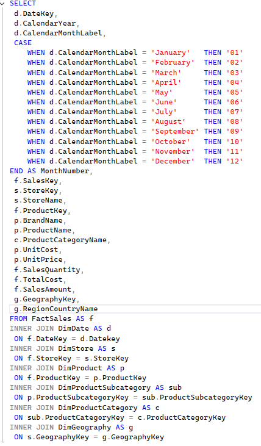

Criei uma coluna extra com o número de cada mês, para que no Power BI os meses pudessem ficar organizados na ordem correta. Chamei a coluna de **"MonthNumber"**.

O resultado foi a seguinte tabela:
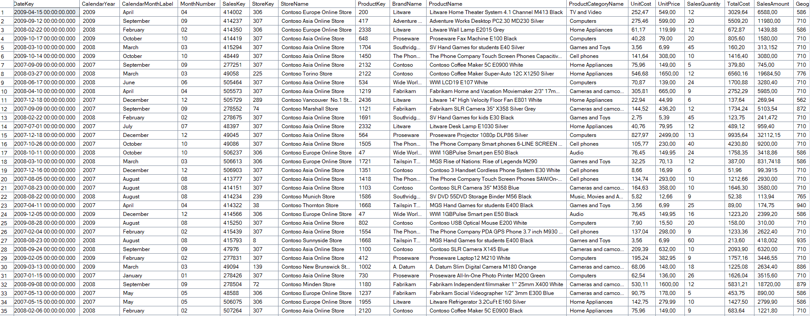

Como é possível observar na foto, por se tratar de muitas informações na mesma tabela, fica inviável de obter qualquer insight olhando pra ela. Para isso, usamos o Power BI.

## Criação de View
Para que fosse possível utilizar esses dados no Power BI, transformei a consulta em uma **VIEW** no SQL, e para isso foi preciso apenas adicionar a seguinte linha:
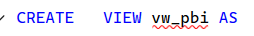

Com isso, a consulta foi salva dentro da VIEW **vw_pbi**.

## Conexão com Power BI
No Power BI, abrimos um relatório em branco, e na página inicial do relatório é possível ver a opção **Obter Dados do SQL Server**
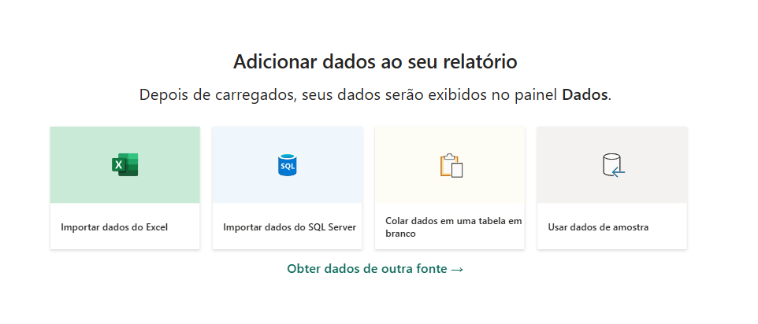

Após isso, basta inserir o Banco de Dados e o Servidor, e uma tela com todas as tabelas do Banco de Dados surgirá. Basta selecionar a **vw_pbi** e abrir o **Power Query**, clicando em **Transformar Dados**.

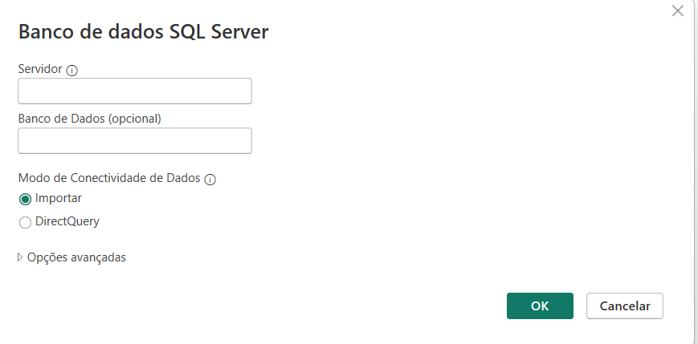
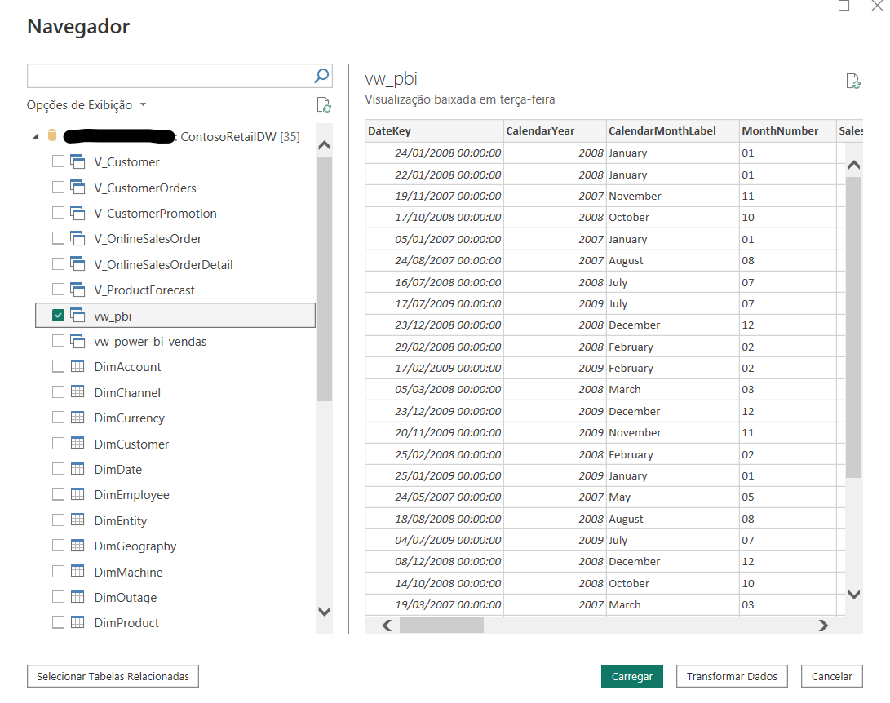

No Power Query, foi preciso fazer alguns tratamentos, colocando Data como Data, números como número e textos como texto.
Esse passo é **Muito importante** para que não haja erros no Dashboard.

## Fórmulas DAX Utilizadas

Para que alguns dados fossem organizados de maneira eficiente, algumas métricas foram criadas com DAX:

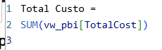 
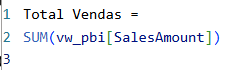
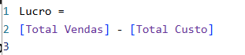       
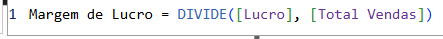
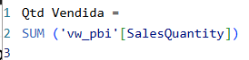
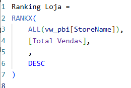
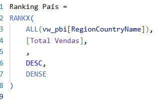
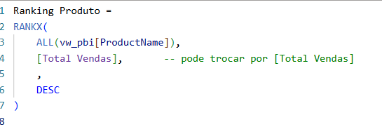

Todas as métricas foram criadas com o objetivo de inserir visuais onde cálculos eram necessários. As métricas de Ranking foram criadas para que apenas os "top 10" de cada produto, país e loja fossem utilizados, tendo em vista o tamanho do banco de dados.

# Dashboards

O Dashboard pronto ficou assim:

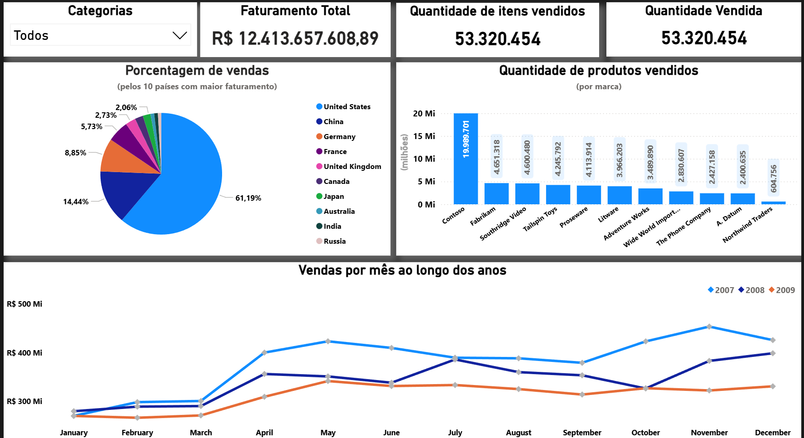
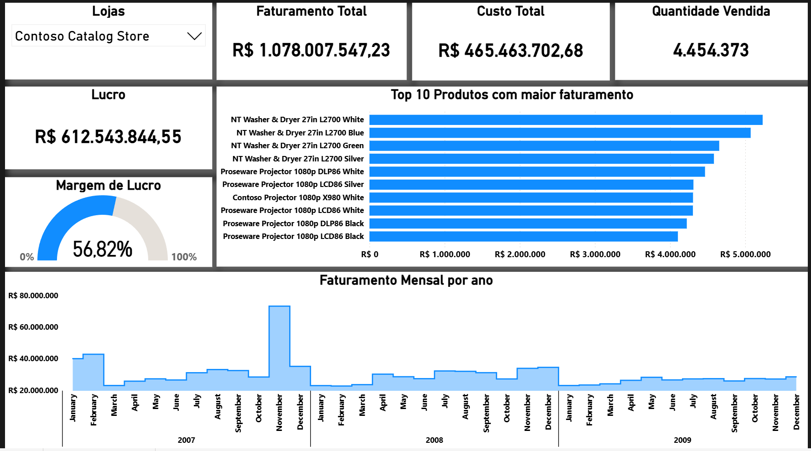

# Insights Relevantes

- Estados Unidos é o país com maior faturamento, detendo 61,19% do faturamento total, e a marca mais vendida no país é a marca Contoso.

- Apesar da queda geral no faturamento de 2007 para 2009, o Japão teve, em 2009, os maiores faturamentos mensais do país.

- A categoria **Games and Toys**, apesar na queda do faturamento geral, teve os maiores faturamentos mensais em 2009, e os países que lideraram esse crescimento (em relação aos outros anos dos países) foram França, Alemanha e China. 

- Apesar da Loja **Contoso Catalog Store** ser a loja com maior faturamento, sua receita vinha caindo, atingindo em 2009 seu menor faturamento, diferentemente da Loja **Contoso Sidney No.1 Store** que teve crescimento no faturamento e atingiu seu maior faturamento em 2009.

Outros insights podem ser obtidos através de análises no Dashboard interativo.
Abaixo, uma demonstração da interação com o dashboard

