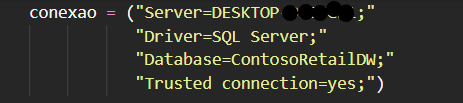
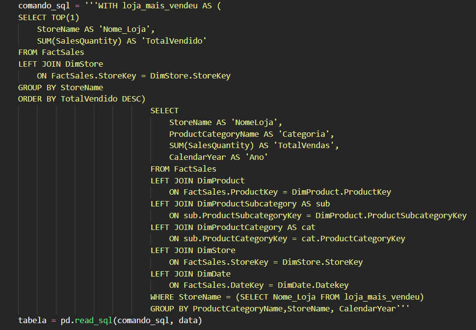
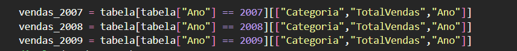
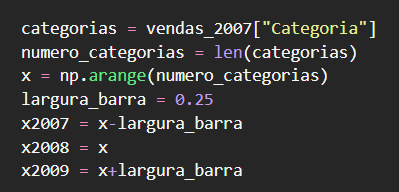
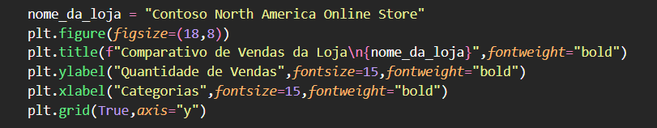
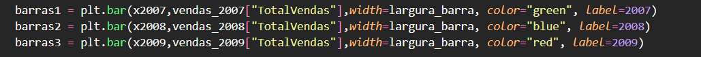
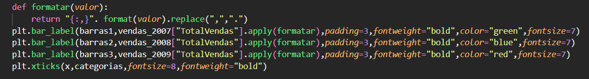
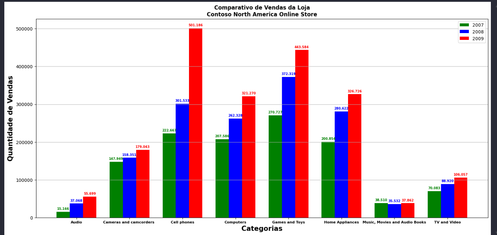

# 🧠 Análise de Vendas - ContosoRetailDW

Este projeto realiza uma **análise comparativa das vendas anuais por categoria** da loja que mais vendeu produtos (em quantidade), utilizando **SQL Server** e **Python** para coleta, tratamento e visualização dos dados.

---

## 📑 Sumário
- [Banco de Dados Utilizado](#-banco-de-dados-utilizado)
- [Consultas SQL](#-consultas-sql)
- [Integração com Python](#-integração-com-python)
- [Visualização dos Resultados](#-visualização-dos-resultados)
- [Conclusões](#-conclusões)
- [Tecnologias Utilizadas](#-tecnologias-utilizadas)
- [Autor](#-autor)

---

## 🗃 Banco de Dados Utilizado

Para esta análise, foi utilizado o banco de dados **ContosoRetailDW**, um banco gratuito disponibilizado pela Microsoft:

🔗 [Download do ContosoRetailDW](https://www.microsoft.com/en-us/download/details.aspx?id=18279)

O objetivo é comparar as **vendas anuais por categoria** da loja que mais vendeu produtos (em quantidade).

---

## 🧩 Consultas SQL

### 🏪 Consulta 1 – Identificar a loja com mais vendas

A primeira consulta identifica a loja que mais vendeu produtos (em quantidade):

**Resultado obtido:**  
Loja com o maior volume de vendas em quantidade.

---

### 📊 Consulta 2 – Separar vendas por categoria e ano

Em seguida, a consulta foi armazenada dentro de uma **CTE** (Common Table Expression) para permitir uma análise detalhada por categoria e ano.

**Resultado da Consulta 2:**

---

## 🐍 Integração com Python

Após obter os dados no SQL, o próximo passo foi importar os resultados para o **Python** e gerar visualizações mais claras.

As bibliotecas utilizadas foram:
- `pyodbc`
- `pandas`
- `matplotlib`
- `numpy`

### 🔗 Conexão com o SQL Server

Para conectar o SQL Server ao Python, foi utilizada a biblioteca `pyodbc`:

Em seguida, a consulta SQL foi armazenada em uma variável e transformada em um DataFrame utilizando o **pandas**:

---

### 📅 Separando os dados por ano

Como os dados são referentes a 2007, 2008 e 2009, foi necessário separar as informações em três tabelas, uma para cada ano:

---

## 📊 Visualização dos Resultados

### 🔧 Preparando o gráfico

Primeiro, foi necessário definir as **categorias** (eixo X) e ajustar a **largura das barras** para que os anos aparecessem lado a lado:

### 🎨 Personalização do gráfico

Configuração do título, nomes dos eixos e tamanho da figura:

### 📅 Exibição das barras por ano

Código para exibir as barras referentes a cada ano:

### 🔢 Exibindo valores sobre as barras

Para melhorar a leitura, foi criada a função `formatar()` que mostra os números de vendas acima de cada barra:

---

### 🖼 Resultado Final

O gráfico gerado mostra a comparação de vendas por categoria entre os anos de 2007, 2008 e 2009:

---

## 📈 Conclusões

A análise mostrou que a **Contoso North America Online Store** apresentou aumento nas vendas em praticamente todas as categorias entre 2007 e 2009.  
A categoria **“Cellphones”** foi a que apresentou o maior crescimento no período.

---

## 💻 Tecnologias Utilizadas

- SQL Server  
- Python  
- Pandas  
- NumPy  
- Matplotlib  
- PyODBC  

---

## 👨‍💻 Autor

**Yuri Oliveira**

🔗 [GitHub](https://github.com/)  
📧 Contato opcional (ex.: seuemail@exemplo.com)

---

    

